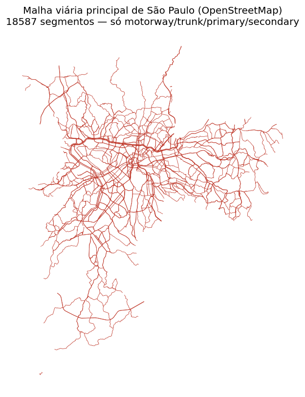
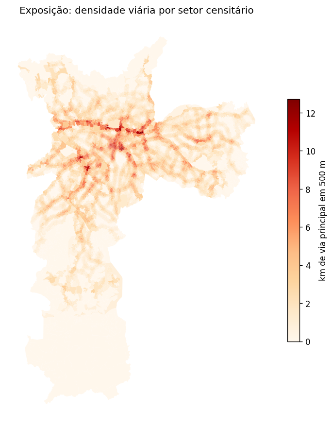
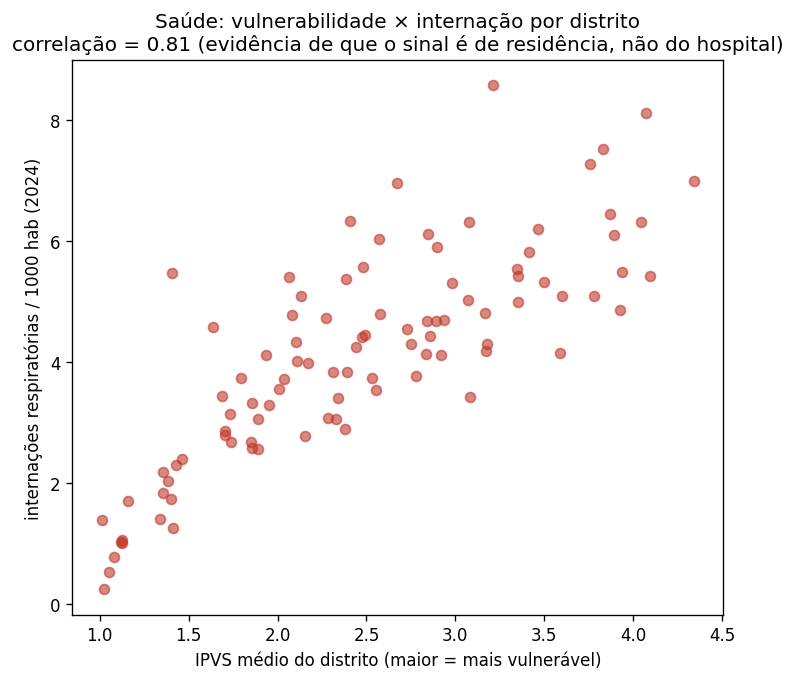
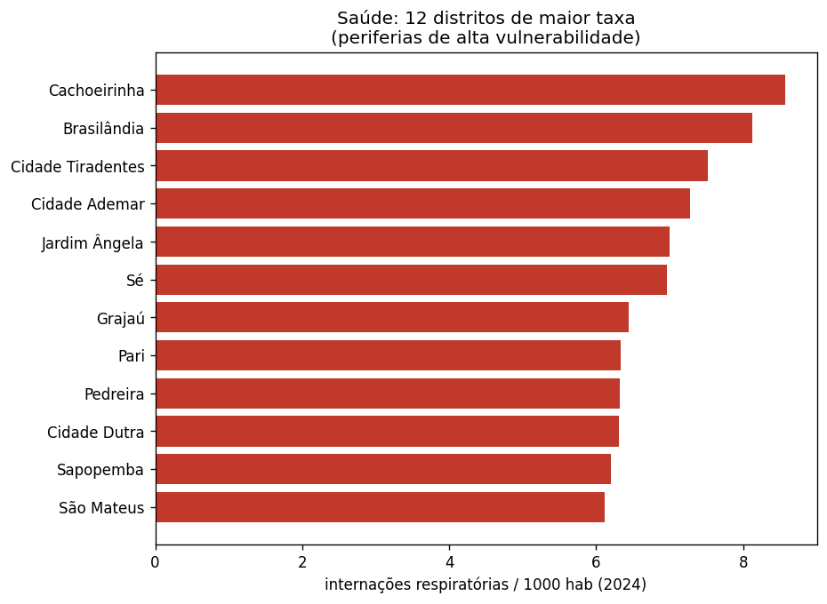
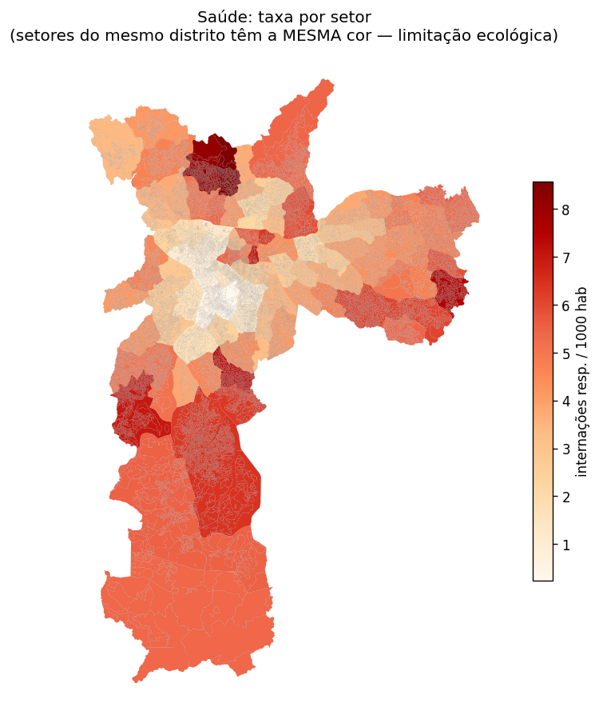
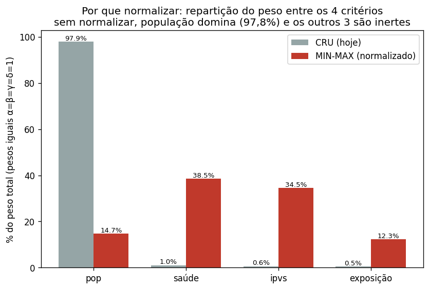

# Considerações sobre os dados

Documento das decisões de processamento e das **limitações de grão** dos dados
usados no projeto. O objetivo é deixar explícito o que cada variável realmente
representa, para que as escolhas apareçam no texto do trabalho e não fiquem
escondidas no código.

> Para **rodar/regenerar** os dados na sua máquina, veja [`README.md`](README.md).
> As figuras citadas aqui ficam versionadas em `docs/figuras/`.

## Grão da análise

A unidade de análise é o **setor censitário** da cidade de São Paulo
(~20 mil setores, chave `CD_SETOR`, Censo IBGE 2022). Cada setor carrega:

- `C_IPVS` — classe de vulnerabilidade social (IPVS 2022; `NaN` → `0`, ver abaixo)
- `POPULACAO` — população do setor (Censo 2022, variável `v0001`)
- centroide em latitude/longitude (reprojetado de EPSG:31983 → EPSG:4326)
- `CD_DIST` / `NM_DIST` — **distrito administrativo** ao qual o setor pertence
  (96 distritos em SP capital). Vem direto do shapefile do IPVS.

O resto do projeto (`algorithms/`, `evaluation/`, `app.py`) apenas **consome**
`data/processed_data/integrated.parquet`. Colunas novas são aditivas e não
quebram o pipeline existente.

## Decisões herdadas do processamento original

- **IPVS sem classificação** (`C_IPVS = NaN`) é tratado como `0`.
- **CETESB**: excluídas as estações que estão na RMSP mas fora da cidade de
  São Paulo (Osasco, Guarulhos, etc.). Além disso, mantidas **apenas as estações
  automáticas** (17 na capital) — monitoramento contínuo em tempo real; as manuais
  (amostragem periódica em laboratório) foram excluídas, pois a proposta é ampliar a
  rede de monitoramento contínuo, então só as automáticas são cobertura comparável.
- **UBS** (CNES): filtradas por `TP_UNIDADE = 2`, gestor municipal de SP
  (`CO_MUNICIPIO_GESTOR = 355030`), não desativadas.

---

## Nova variável: Exposição (tráfego / malha viária) — grão de setor ✅

**Fonte:** OpenStreetMap, via `osmnx` (`highway ∈ {motorway, trunk, primary,
secondary}`).

**Método:** as métricas são calculadas em **EPSG:31983 (SIRGAS 2000 / UTM 23S,
em metros)** — o mesmo CRS nativo das geometrias — para que distâncias e
comprimentos saiam corretos em metros. Para cada setor calculamos duas colunas:

1. **Densidade viária em buffer** — comprimento total (km) de vias principais
   dentro de um raio (ex.: 500 m) do centroide do setor. É o proxy preferido de
   exposição: um setor cercado de vias tem exposição alta mesmo que o centroide
   não esteja colado em nenhuma.
2. **Distância à via principal mais próxima** — distância ponto→linha (metros),
   mais fácil de interpretar.

**Observação:** medimos distância à *linha* da via (não ao vértice mais
próximo), o que é mais preciso. Não reutilizamos a haversine ponto-a-ponto do
`integrate_parquets.py` justamente por isso.

**Limitação:** proximidade/densidade de vias é um *proxy* de exposição, não uma
medida direta de fluxo de veículos ou de concentração de poluentes. Não
distingue horário de pico, sentido, nem volume real de tráfego.

**Por que só vias principais (e não ruas de bairro):** ruas locais cobrem a cidade
de forma quase uniforme — incluí-las tornaria a densidade praticamente constante e
sem poder de diferenciação. As vias principais (arteriais/expressas) é que
concentram tráfego e se distribuem de forma desigual, gerando o contraste útil.



*Malha viária principal usada como base (18.587 segmentos, só motorway/trunk/primary/secondary).*



*Densidade resultante por setor: mais alta ao longo dos corredores viários conhecidos
(marginais, grandes avenidas) — checagem de sanidade do cálculo.*

---

## Nova variável: Saúde (internações respiratórias) — grão de DISTRITO ⚠️

**Fonte:** microdado do DATASUS **SIH-SUS / AIH Reduzida (grupo RD)**, baixado do
**FTP legado** do DATASUS (`ftp.datasus.gov.br`, `/dissemin/publicos/SIHSUS/200801_/Dados`,
arquivos `RD<UF><AAMM>.dbc`). Filtro por CID-10 do capítulo de doenças
respiratórias (`DIAG_PRINC` começando com `J`, ou seja J00–J99) e por
**residentes da capital** (`MUNIC_RES == 355030`). Período usado: **2022
inteiro** (12 meses) — escolhido para **casar temporalmente** com o Censo IBGE
2022 (população), o IPVS 2022 e o CNEFE 2022, mantendo a análise transversal
coerente no tempo. (O padrão espacial é robusto ao ano: rodando 2024, os mesmos
distritos periféricos lideram e a correlação com o IPVS quase não muda — 0,81 em
2022 vs 0,83 em 2024. 2022 traz ~53 mil internações contra ~58 mil em 2024, sem
sinal de inflação por COVID/Ômicron nos totais.)

> Nota: a função fácil `pysus.sih()` **não serve** aqui — ela consulta o catálogo
> novo ("DuckLake") do pysus, que só tem o grupo SP (Serviços Profissionais)
> indexado, não o RD. Por isso o download é feito direto no FTP.

### Por que distrito, e não estabelecimento (decisão importante)

O TabNet municipal de SP oferece quebra por "Distrito Administrativo", **mas por
distrito do estabelecimento (hospital), não da residência do paciente** — usar
isso enviesaria o dado para os poucos distritos com grandes hospitais. Por isso
**não** usamos o TabNet. Em vez disso, geolocalizamos a internação pela
**residência do paciente**, via o **CEP** que existe no microdado RD.

### Como o CEP vira distrito (sem geocodificação por API)

O RD traz o campo `CEP` do paciente (confirmado: **100% preenchido e válido**
entre as internações respiratórias de residentes da capital). Para converter
`CEP → distrito` usamos o **CNEFE 2022 do IBGE** (Cadastro Nacional de Endereços),
que lista, por endereço de SP, `CEP` + `COD_DISTRITO`. Construímos um lookup
`CEP → distrito` (distrito **modal** por CEP; **95,1%** dos CEPs caem num único
distrito). O `COD_DISTRITO` do CNEFE tem o mesmo formato do `CD_DIST` do IPVS —
join direto, **sem crosswalk e sem coordenadas**.

Cobertura: apenas **1,60%** das internações ficaram sem distrito (CEP ausente no
CNEFE) e são descartadas.

### Cálculo

```
taxa_distrito (por 1000 hab) = internações respiratórias do distrito (2022)
                               ------------------------------------------------ × 1000
                               população do distrito (soma das POPULACAO dos setores)
```

Cada setor recebe a `taxa_resp_por_1000` do seu `CD_DIST` / `NM_DIST`.

### Limitação de grão (deve constar no texto do trabalho)

A internação é geolocalizada por **residência**, o que é o correto — mas a
resolução final é de **distrito** (96 unidades), não de setor: **todos os setores
de um mesmo distrito herdam a mesma taxa**. Isso é uma **limitação ecológica**
(agregação areal), assumida deliberadamente porque, com ~53 mil internações/ano,
descer a setor (~27 mil) deixaria a taxa dominada por ruído (≈1–2 casos/setor).
Distrito é o nível em que a taxa é estatisticamente estável.

### Sanidade do resultado

Os distritos de maior taxa são periferias de alta vulnerabilidade
(Cachoeirinha, Brasilândia, Cidade Tiradentes, Cidade Ademar, Jardim Ângela) —
coerente com o esperado e evidência de que o sinal está na **residência**, não no
hospital.



*Correlação positiva (0,81) entre IPVS médio do distrito e taxa de internação
respiratória. Se o sinal fosse do hospital (e não da residência), esperaríamos o
oposto — distritos ricos com hospitais-polo teriam as maiores taxas. É a evidência
de que a geolocalização por CEP capturou a residência corretamente.*



*Os 12 distritos de maior taxa — todos periferias de alta vulnerabilidade.*



*A limitação de grão, visível: todo setor de um mesmo distrito recebe a mesma cor
(mesma taxa). O centro (baixa vulnerabilidade) aparece claro; as periferias, vermelhas.*

---

## Normalização dos critérios (min-max)

Os quatro critérios de priorização — população, saúde, IPVS e exposição — entram na
função-objetivo como soma ponderada: `w = α·pop + β·saúde + γ·IPVS + δ·exposição`.
Mas eles vivem em **escalas incompatíveis** (população 0–2.221; saúde 0,5–8,6; IPVS
0–6; exposição 0–12,7). Somados crus, a **população domina 97,8%** do peso e os
outros três viram inertes (juntos ~2%) — os pesos α/β/γ/δ deixam de controlar a
decisão. É o comportamento-padrão de análise multicritério (MCDA): critérios têm que
ser normalizados antes de combinar.



*Sem normalizar, população leva 97,8% do peso (cinza). Com min-max, os quatro passam a
escalas comparáveis (vermelho) e os pesos voltam a mandar na decisão.*

**Método:** min-max para [0,1] — `(x − mín) / (máx − mín)` — aplicado a cada critério.

**Onde mora (decisão de arquitetura):** os algoritmos **não sabem** se os dados são
normalizados; quem normaliza é o **provedor de dados**. Os valores **crus** seguem
disponíveis (população = pessoas para as métricas de cobertura; IPVS = classe para as
máscaras de vulnerabilidade); os critérios **normalizados** são entregues à parte e
usados **só no peso**. Assim as métricas de resultado continuam medindo pessoas e
classes reais — só a função-objetivo passa a usar critérios comparáveis.
